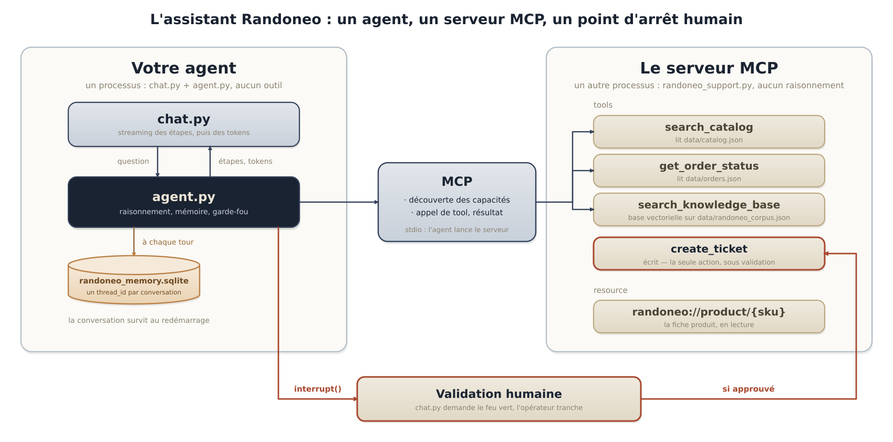
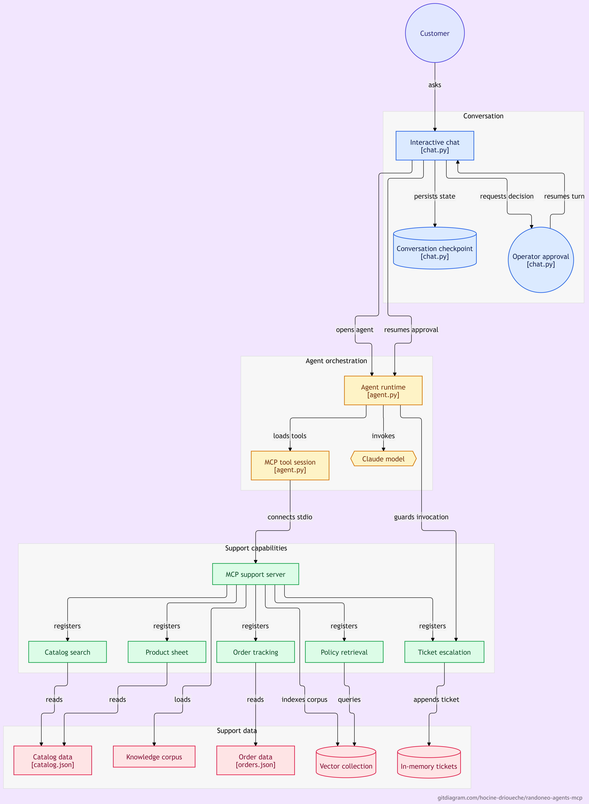

# Assistant de support Randoneo — outillé par MCP

Un assistant de support en ligne de commande pour Randoneo, une boutique
d'équipement outdoor. L'agent ne contient **aucun outil** : toutes les
capacités viennent d'un **serveur MCP** dédié.

## Statut

✅ **Fonctionnel** — 6/6 scénarios validés

## Fonctionnalités

- **Serveur MCP** : 4 tools (`search_catalog`, `get_order_status`,
  `search_knowledge_base`, `create_ticket`) + 1 resource (`product_sheet`)
- **Agent ReAct** : découvre les outils du serveur MCP au démarrage
- **Mémoire persistante** : SQLite + `thread_id` (reprise de conversation)
- **Garde-fou humain** : validation avant `create_ticket` (seule action sensible)
- **Streaming** : les étapes (outils appelés) puis les tokens de la réponse

## Architecture

```
┌─────────────────────────────────────────────────────────┐
│ AGENT (agent.py + chat.py)                             │
│ - Modèle : Claude Haiku                                │
│ - Mémoire : SQLite (AsyncSqliteSaver)                  │
│ - Garde-fou : interrupt() sur create_ticket            │
│ - Aucun outil en dur                                   │
└─────────────────────────────────────────────────────────┘
                          │
                          │ MCP (stdio)
                          ▼
┌─────────────────────────────────────────────────────────┐
│ SERVEUR MCP (randoneo_support.py)                      │
│ - 4 tools + 1 resource                                 │
│ - Lit : catalog.json, orders.json, randoneo_corpus.json│
└─────────────────────────────────────────────────────────┘
```
## Architecture visuelle

### Pipeline  (vue simplifiée)



### Diagramme détaillé



## Installation

### 1. Cloner le projet

```bash
git clone https://github.com/hocine-drioueche/randoneo-agents-mcp.git
cd randoneo-agents-mcp
```

### 2. Créer un environnement virtuel

```bash
python -m venv .venv
source .venv/bin/activate  # Linux/Mac
# .venv\Scripts\activate   # Windows
```

### 3. Installer les dépendances

```bash
pip install -r requirements.txt
```

### 4. Configurer les clés API

```bash
cp .env.example .env
nano .env
```

**Contenu** :

```
OPENAI_API_KEY=sk-proj-xxxxx
ANTHROPIC_API_KEY=sk-ant-xxxxx
```

## Utilisation

### Chat interactif

```bash
python chat.py
```

**Exemple** :

```
❓ Vous : Où en est ma commande RND-10235 ?
🔧 get_order_status({"order_id": "RND-10235"})
   ↳ {"order_id":"RND-10235","status":"preparing",...}
💬 Votre commande RND-10235 est en préparation...

❓ Vous : Ma tente de RND-10238 est déchirée, je veux un remplacement.
🔧 create_ticket({"intent": "return_refund", ...})

============================================================
  ⚠️  VALIDATION HUMAINE REQUISE
============================================================
  Action : create_ticket
  Arguments :
    - intent : return_refund
    - order_id : RND-10238
    - summary : Tente déchirée - demande de remplacement
============================================================
  Approuver ? (o/n) : o

   ↳ Ticket TICK-001 ouvert (return_refund).
💬 Votre demande de remplacement a été enregistrée.
```

### Reprendre une conversation

```bash
# Note le thread_id affiché au démarrage (ex: session-abc123)
python chat.py --thread session-abc123
```

### Scénarios de test

```bash
python demo.py
```

**Sortie** :

```
① J'ai combien de temps pour retourner un article ?
   ✅ search_knowledge_base appelé
   ==> PASS
...
==================================================
Résultat : 6/6 scénarios validés
```

## Justification d'architecture

**Pourquoi un agent unique outillé par MCP plutôt qu'une chaîne ou un multi-agent ?**

En appliquant l'arbre de décision du cours :

1. **Un seul appel suffit ?** Non — il faut des données externes (catalogue, commandes, documentation).
2. **Séquence connue d'avance ?** Non — le chemin dépend de la question (parfois 1 outil, parfois 2).
3. **Le chemin dépend de ce qu'on découvre ?** Oui → **Agent**.
4. **Plusieurs spécialités à coordonner ?** Non — un seul agent outillé suffit.
5. **Les outils doivent-ils être réutilisés ?** Oui (un conseiller pourrait les utiliser via Claude Desktop) → **MCP**.

**Verdict** : un agent unique, outillé via MCP. Pas de multi-agent (aucune spécialité distincte), pas de chaîne (chemin variable).

## Compétences mobilisées

- **Conception MCP** : tools, resource, descriptions
- **Agent ReAct** : boucle, mémoire, streaming
- **Human-in-the-loop** : `interrupt()` + `Command(resume=...)`
- **Mémoire** : `AsyncSqliteSaver` + `thread_id`
- **Arbitrage** : choix d'architecture

## Auteur

Hocine Drioueche — [drioueche.hocine@gmail.com](mailto:drioueche.hocine@gmail.com)